# 📊 Tableau | Executive Sales Performance & Profitability Analysis

## 🏢 About Maven Supplies

Maven Supplies is a cutting-edge office supply retailer focused on bringing innovative solutions to everyday office essentials.  
From copy paper and sticky notes to office technology, Maven Supplies aims to combine **quality, efficiency, and customer-centric design** to deliver a modern office experience.  
Maven Supplies prides itself on **fast fulfillment, insightful product recommendations, and an innovative catalog** that adapts to modern office needs.

---

## 🚀 Project Overview

This project delivers an **executive-grade Tableau analytics solution** built to answer a single, critical business question:

**What truly drives sales, profit, and loss — and why?**

Rather than maximizing visual complexity, this solution prioritizes **clarity, causality, and business logic**.  
Interactive dashboards and guided analytical stories move beyond surface-level reporting to explain the **economic mechanics** behind performance — enabling confident, defensible decision-making.

The design is intentionally minimalist, ensuring that every visual earns its place and directly supports insight generation.  
Additional commentary and contextual tooltips are embedded where appropriate to **guide executives through key insights** without overwhelming them.

---

## 🧠 Executive Questions Answered

- Which regions and cities genuinely drive *profitable* growth?
- Are high sales translating into profit — or masking structural losses?
- How do discounting behaviors impact margins at a sub-category level?
- Which products should be scaled, fixed, or deprioritized?
- Is profitability driven by volume, pricing power, or order economics?
- Where are risk concentrations in terms of customers, discounts, or seasonal dependencies?

---

## 🛠️ Tools & Capabilities Demonstrated

- Tableau Desktop / Tableau Public
- Advanced calculated fields & parameters
- Conditional color logic for financial interpretation
- Interactive dashboard actions & cross-filtering
- Executive KPI (BAN) design principles
- Business-first analytical storytelling
- Story points for guided analysis and decision-oriented narratives
- Custom formatting for executive-ready visuals and dashboards

---

## 📈 Executive Dashboard — Performance at a Glance

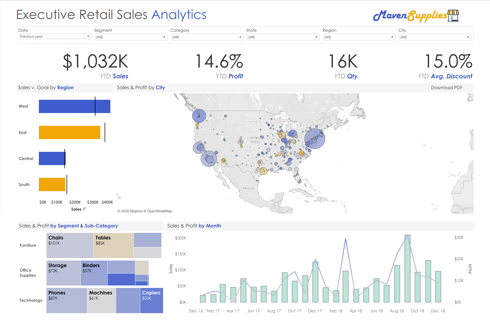

### Purpose  
Provide leadership with a **single, authoritative view** of overall performance while preserving the ability to drill into detail instantly.

### What This Dashboard Enables
- Immediate visibility into YTD Sales, Profit %, Quantity, and Avg Discount
- Identification of geographic concentration and risk at the city level
- Target attainment tracking across regions
- Recognition of seasonal and trend-based performance patterns
- Clear understanding of revenue mix by segment and sub-category
- Ability to spot anomalies and structural issues in revenue streams

This dashboard answers *“How are we doing?”* in seconds — without sacrificing analytical depth.

---

## 🌍 Geographic Performance — Sales & Profit by City

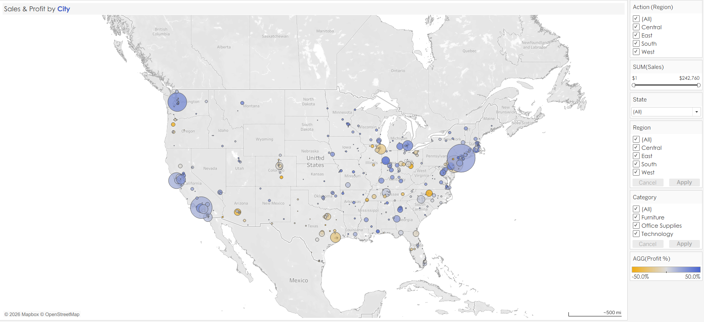

This view reveals **where revenue is generated and where profit is retained**.

- Bubble size represents total sales by city
- Color encodes profit percentage (loss → profit)
- Tooltips expose each city’s contribution to state-level sales
- Filters allow rapid geographic isolation and comparison
- Layered view highlights both high-volume and high-margin locations

**Business Value:**  
Surfaces cities that generate strong revenue but weak or negative margins — a critical executive blind spot.  
Supports **strategic expansion, resource allocation, and local promotional strategies**.

---

## 🎯 Sales vs Goal — Regional Accountability

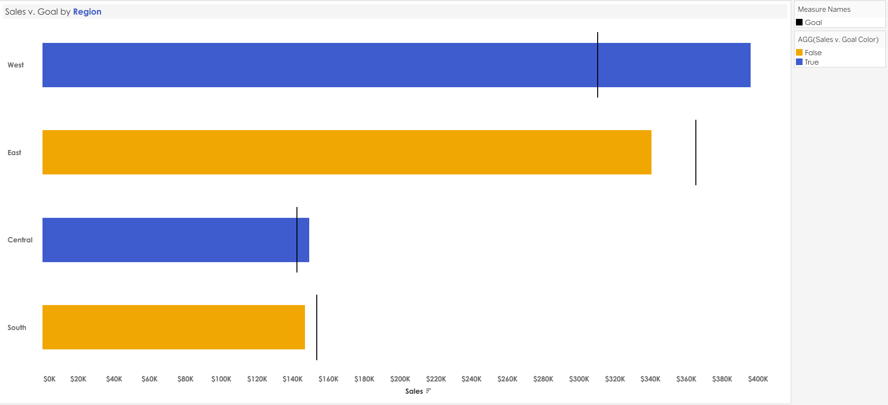

This view compares actual regional sales against predefined targets.

- Bars represent actual sales
- Reference lines indicate regional goals
- Color logic instantly highlights over- and under-performance
- Dynamic annotations explain the variance drivers per region

**Business Value:**  
Transforms static targets into visible, actionable accountability.  
Helps executives focus on underperforming regions while rewarding outperformers.

---

## 📉 Sales & Profit Trend — Monthly Dynamics

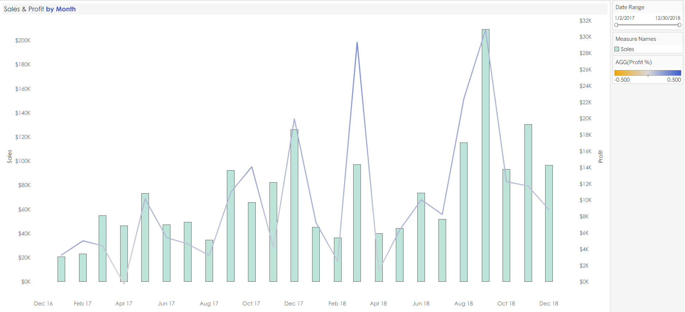

A dual-axis view combining:
- Sales (bars)
- Profit (line)

This chart highlights:
- Seasonality effects
- Divergence between revenue growth and profitability
- Critical inflection points over time
- Subtle anomaly detection (months where profit dips despite high sales)

**Business Value:**  
Ensures growth is evaluated through a profitability lens, not revenue alone.  
Supports **budgeting, forecasting, and strategic planning**.

---

## 🧩 Revenue Mix — Sales by Sub-Category

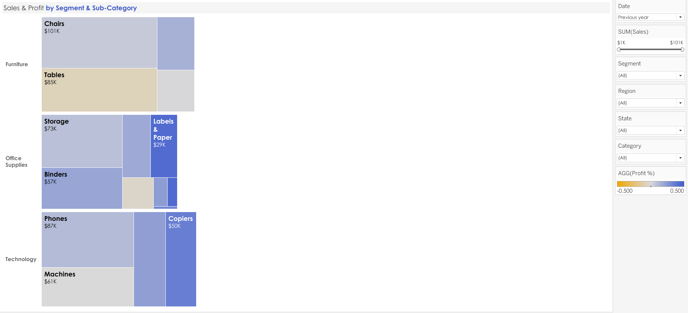

This treemap illustrates how revenue is distributed across categories and sub-categories.

- Highlights true revenue drivers
- Preserves clarity through selective labeling
- Enables quick identification of scale versus fragmentation
- Provides immediate insight into product portfolio balance

---

## 👥 Customer Concentration — Top Customers by Sales

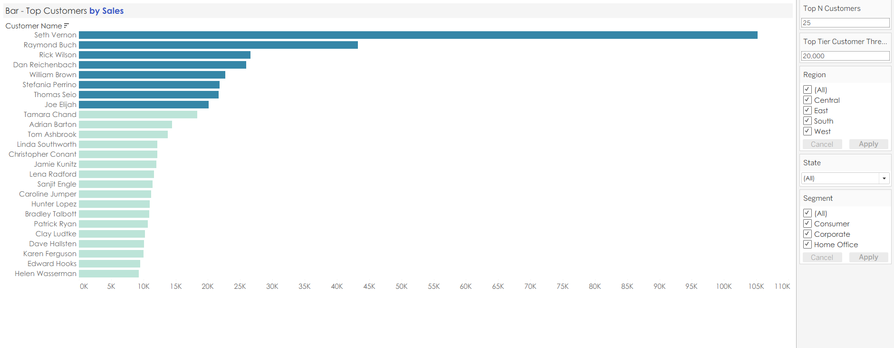

This view identifies **revenue concentration risk** using a dynamic Top-N framework.

- Default view displays the Top 25 customers
- Parameter allows executives to redefine “Top” instantly
- Visual separation between Top-Tier and non-Top-Tier customers
- Offers insights into **customer dependency risk and retention focus areas**

**Key Insight:**  
A small subset of customers contributes a disproportionate share of total revenue, introducing dependency risk.  
Facilitates targeted client relationship management and priority account strategy.

---

## 📊 Dashboard — Drivers of Profit & Loss (Analytical Core)

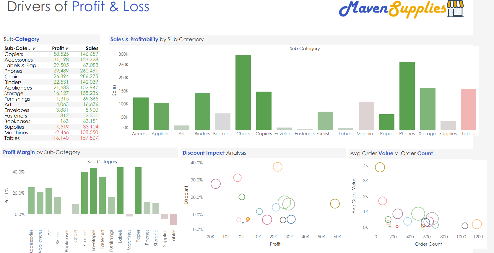

This dashboard represents the **analytical core** of the project.

Rather than describing outcomes, it explains **why they occur** by connecting:

- Sales & Profitability by Sub-Category
- Profit Margin by Sub-Category
- Discount Impact Analysis
- Average Order Value vs Order Count
- Temporal trends and seasonal performance anomalies

### Interaction Design  
All visuals are fully cross-filtered.  
Selecting any element dynamically reshapes the remaining views, enabling rapid root-cause analysis without losing context.  
Additional annotations and tooltips provide **contextual guidance for executives**, ensuring no insight is missed.

---

## 📖 Story — Top Cities & Sub-Categories

### NYC: The Largest Sales Contributor

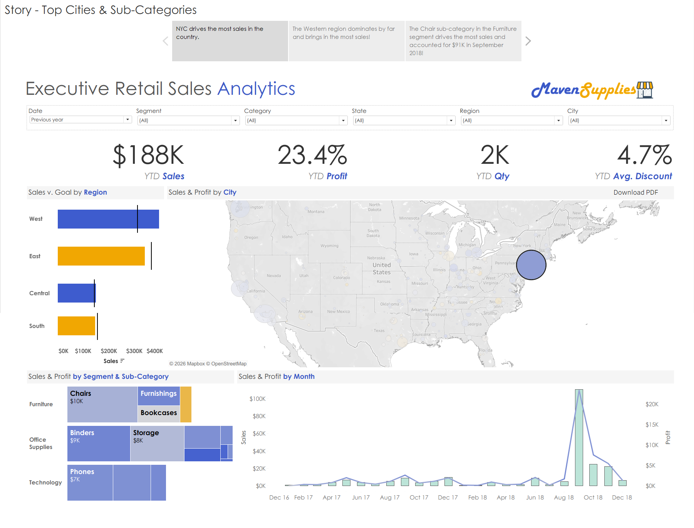

- NYC leads national sales contribution
- Strong profitability accompanies high volume
- Key sub-category drivers:
  - Furniture → Chairs
  - Office Supplies → Binders
  - Technology → Phones
- Peak sales and profit occur concurrently in September 2018

**Insight:**  
NYC’s performance is diversified across categories rather than dependent on a single product line.  
Allows executives to **benchmark other cities** against NYC’s performance profile.

---

### Western Region: Sustained Regional Leadership

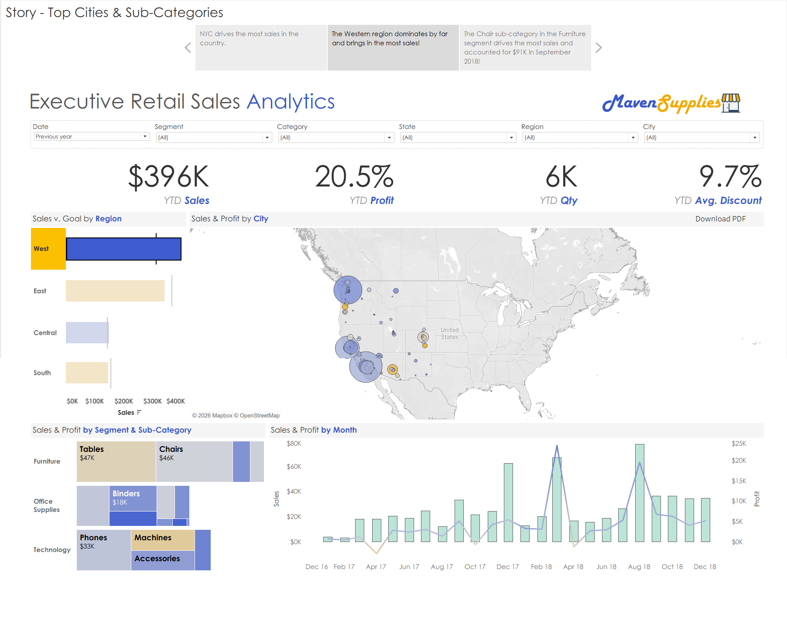

- The Western region outperforms all others in YTD sales
- Product leadership differs materially from NYC
- Highlights how geography reshapes product economics
- Enables regional strategy refinement

---

### Chairs: A High-Volume Sales Driver

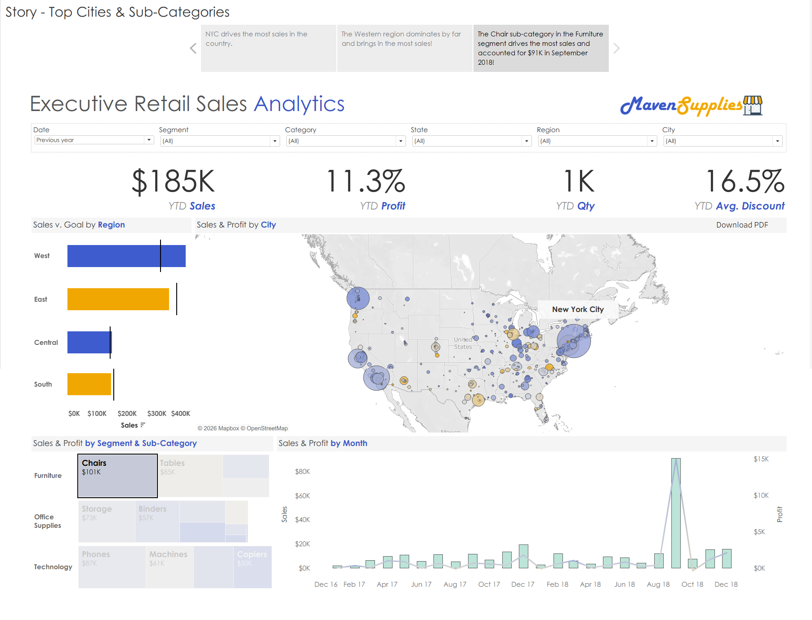

- Chairs generated significant peak-period sales
- High volume with moderate margins
- Reinforces the need to balance scale with profitability discipline
- Demonstrates product-level operational efficiency and revenue contribution

---

## 📖 Story — Sub-Category Profit & Loss Drivers (Deep-Dive Analysis)

This story represents the **analytical apex** of the project.  
It isolates individual sub-categories to explain *how* and *why* revenue converts into either profit or loss.  
It provides **root-cause insights**, actionable for pricing, discounting, and product strategy.

---

### Tables — High Sales, Largest Losses

At first glance, **Tables** appear commercially successful.  
They generate **$157,807 in total sales**, ranking among the stronger revenue contributors.

However, deeper analysis reveals a fundamentally broken economic model.

#### Root Cause Breakdown
When all visuals are filtered to Tables:

- **Profit Margin:** –10.2% (lowest among all sub-categories)
- **Average Discount:** ~27.8%, the highest in the portfolio
- **Order Count:** 256 orders (strong demand signal)
- **Average Order Value:** ~$848 (relatively low)

#### Interpretation
Demand for Tables is **not the problem**.  
The issue lies in **how that demand is monetized**.

High order volume combined with aggressive discounting compresses margins to the point where each incremental sale deepens total losses.  
Visual cues and conditional formatting highlight risk zones for executive review.

**Business Insight:**  
Tables illustrate a classic case where revenue growth masks structural unprofitability.  
Without pricing discipline or discount governance, scaling volume amplifies losses rather than correcting them.  
Supports decision-making for **strategic repricing, promotional limits, or product redesign**.

---

### Copiers — Fewer Orders, Exceptional Profitability

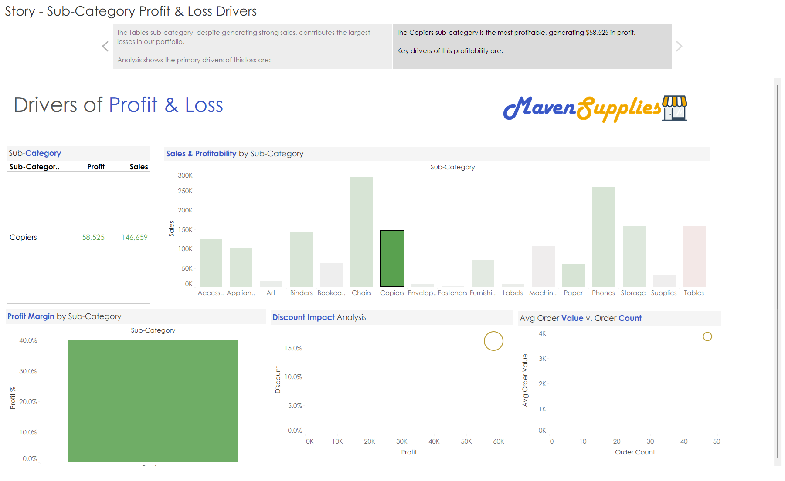

Copiers demonstrate the exact opposite economic profile.

Despite lower transaction volume, they deliver **outsized profitability**.

#### Profit Driver Breakdown
Filtering the dashboard to Copiers reveals:

- **Total Sales:** $146,659
- **Total Profit:** $58,525
- **Profit Margin:** 39.9% (highest across sub-categories)
- **Order Count:** 47 orders
- **Average Order Value:** ~$3,859
- **Average Discount:** ~16.2%

#### Interpretation
Copiers succeed not through volume, but through **pricing power and order economics**.  
Conditional formatting and tooltips reinforce understanding of margin contribution per transaction.

Each transaction carries sufficient margin to absorb discounting while still producing substantial profit.

**Business Insight:**  
Copiers represent a scalable, defensible profit engine — and a benchmark for evaluating other sub-categories.  
Ideal for executives considering **expansion, prioritization, or portfolio optimization**.

---

## 📱 Multi-Device Accessibility

All dashboards are designed for **desktop, tablet, and mobile consumption**, ensuring accessibility for executives across devices without compromising analytical integrity.  
Guided navigation and responsive design enhance usability and decision speed.

---

## 🖼️ Full Visuals Gallery

All dashboards, analytical views, and story slides are available in the [`visuals/`](visuals/) folder, including additional supporting visuals not embedded directly in this README.  
The gallery includes **extra annotations, contextual tooltips, and detailed drill-down snapshots** for deep review.

---

## 💾 How to View the File

The complete Tableau analysis is packaged in:

`maven_supplies_analysis.twbx`

Open the file in **Tableau Desktop** or **Tableau Public** to explore:
- Interactive dashboards
- Cross-filtering and actions
- Parameters and drill-down analysis
- Story-driven analytical narratives

---

## 🏁 Final Takeaway

This project demonstrates a complete executive analytics workflow — from performance monitoring to root-cause diagnosis.  
It shows how Tableau can be used not just to visualize data, but to **explain business outcomes, uncover hidden economic patterns, and inform strategic decisions**.  
The level of detail ensures this project is **CEO-ready, boardroom-ready, and benchmark-setting for future Tableau work**.
