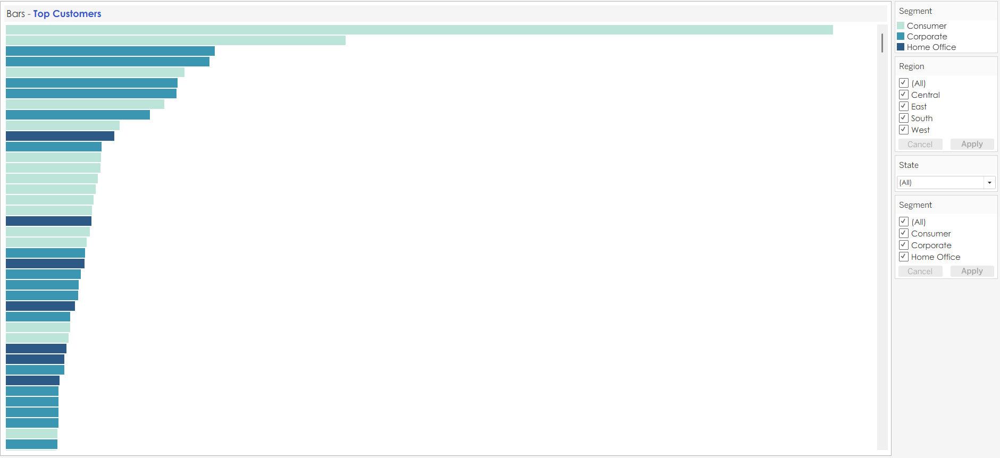
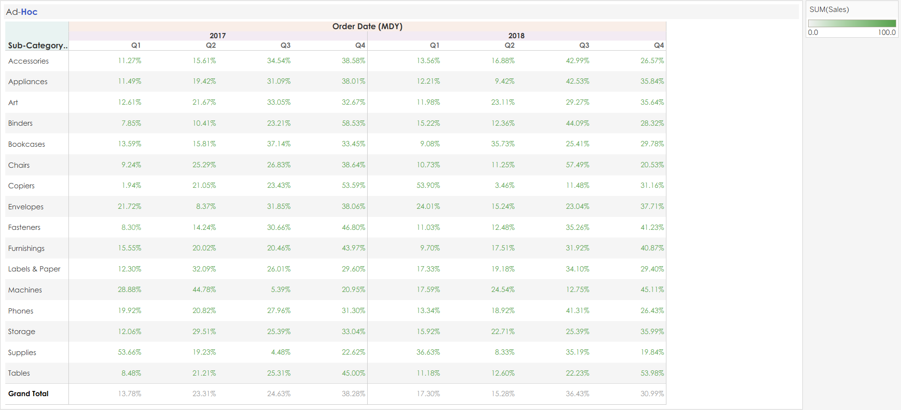

# 📊 Tableau | Executive Sales Performance & Profitability Analysis

## 🚀 Project Overview

This project delivers an **executive-ready Tableau analytics solution** designed to uncover **what drives sales, profit, and loss** across regions, customers, and product sub-categories.

Built with a strong emphasis on **business reasoning over visual complexity**, the solution combines interactive dashboards and analytical stories to move beyond *what happened* and clearly explain **why it happened** — enabling confident, data-driven commercial decisions.

> **Core focus:** Profitability drivers, discount impact, customer concentration, and sub-category economics.

---

## 🧠 Business Questions Answered

This project was built to answer real executive-level questions:

- Which cities and regions truly drive revenue and profit?
- Are our best-selling products actually profitable?
- How do discounts influence margins and losses?
- Which sub-categories should be scaled, fixed, or reconsidered?
- Are profits driven by volume, pricing power, or order economics?

---

## 🛠️ Tools & Skills Demonstrated

- Tableau Desktop (Dashboards, Stories, Actions)
- Advanced calculated fields & parameters
- Conditional color encoding for financial interpretation
- Executive KPI (BAN) design
- Cross-filtering and interaction design
- Business-first analytical storytelling

---

## 📈 Dashboard 1 — Executive Performance Overview

### 🎯 Purpose  
Provide leadership with a **single source of truth** for performance while retaining the ability to drill down instantly.

### Key Elements
- KPI / BAN cards for YTD Sales, Profit %, Quantity, and Avg Discount  
- Geographic sales & profit map highlighting city-level concentration  
- Sales vs goal comparison by region  
- Monthly sales (bars) and profit (line) trend  
- Sales distribution by sub-category via treemap  

### Why It Matters  
This dashboard answers *“How are we doing?”* in seconds — while enabling deeper exploration without clutter or cognitive overload.

---

## 👥 Customer Intelligence

### Top Customers Overview

- Customers ranked by total sales
- Segment-based color encoding
- Region, state, and segment filters
- Rich tooltips for instant customer profiling

---

### Top Customers by Sales (Threshold-Based)

- Dynamic **Top-N parameter** (default: Top 25)
- Visual separation between **Top-Tier** and non-Top-Tier customers
- Highlights revenue concentration and dependency risk

---

## 📋 Ad-Hoc Sales Analysis

- Sub-category vs Year & Quarter breakdown
- % contribution to total sales
- Conditional color gradients for fast comparison
- Enables temporal analysis without visual clutter

---

## 📊 Dashboard 2 — Drivers of Profit & Loss

### 🎯 Purpose  
This dashboard represents the **analytical core** of the project.

It is explicitly designed to explain **causality**, not just performance.

### Core Analytical Views
- Sub-Category Sales & Profit table  
- Sales & Profitability by Sub-Category  
- Profit Margin by Sub-Category  
- Discount Impact Analysis  
- Avg Order Value vs Order Count  

### Interaction Design  
All visuals are fully interconnected.  
Selecting *any* bar, bubble, or row dynamically filters the remaining visuals — enabling rapid root-cause analysis without leaving context.

---

## 📖 Story 1 — Top Cities & Sub-Categories

### Slide 1: NYC Drives the Most Sales

- NYC contributes **$188K in YTD Sales**
- Strong profitability at **23.4%**
- Primary sub-category drivers:
  - Furniture → Chairs  
  - Office Supplies → Binders  
  - Technology → Phones  
- Both peak sales and profit occurred in **September 2018**

---

### Slide 2: Western Region Dominance

- Western region leads with **$396K YTD Sales**
- Strong and balanced profitability across segments
- Sub-category leadership differs from NYC:
  - Furniture → Tables  
  - Office Supplies → Binders  
  - Technology → Phones  
- Demonstrates how geographic context changes product economics

---

### Slide 3: Chairs as a Sales Powerhouse

- Chairs generated **$91K in sales in September 2018 alone**
- High-volume driver with moderate margins
- Reinforces the importance of combining category and time-based analysis

---

## 📖 Story 2 — Sub-Category Profit & Loss Drivers (Core Insight)

This story represents the **analytical peak** of the project — explaining *why* certain sub-categories succeed while others fail.

---

### Slide 1: Tables — High Sales, Largest Losses

Despite generating **$157,807 in sales**, the **Tables** sub-category produces the **largest absolute loss** at **–$16,140**.

#### Root Cause Breakdown
Filtering all visuals to Tables reveals:

- **Profit Margin:** –10.2% (lowest of all sub-categories)
- **Average Discount:** ~27.8%, severely eroding margins
- **Order Count:** High (256 orders)
- **Avg Order Value:** Low ($848)

#### Key Insight  
Losses are **not driven by weak demand**, but by **pricing and discount strategy**.  
High volume combined with aggressive discounting converts sales into structural losses.

> **Business implication:** Pricing discipline and discount control must precede further volume growth.

---

### Slide 2: Copiers — Fewer Orders, Exceptional Profitability

Copiers present the complete inverse of Tables.

#### Profit Drivers
- **Total Sales:** $146,659  
- **Profit:** $58,525  
- **Profit Margin:** 39.9%  
- **Order Count:** Low (47 orders)  
- **Avg Order Value:** Extremely high ($3,859)  
- **Discount:** Moderate (~16.2%)

#### Key Insight  
Profitability is driven by **pricing power and order economics**, not order volume.

> **Business implication:** Copiers represent a category worth protecting, expanding, and learning from.

---

## 🧩 Why This Project Stands Out

- Prioritizes **business logic over visual density**
- Demonstrates **causality**, not correlation
- Uses Tableau as a **decision-making tool**, not a charting tool
- Designed around how executives actually consume analytics

---

## 🏁 Conclusion

This Tableau project represents a **complete analytical workflow** — from executive overview to root-cause diagnosis — and demonstrates how interactive BI can be used to **explain outcomes, not just report them**.

It stands as a **capstone-level portfolio project**, intentionally designed to match — and surpass — real-world business analytics expectations.
